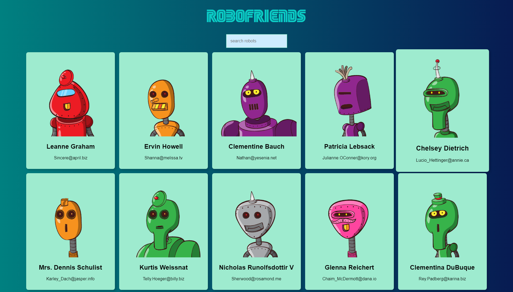

[][license-url]
[![LinkedIn][linkedin-shield]][linkedin-url]

# Robofriends
Live Site: https://dextervorbe.github.io/robofriends/

An Application where the user will be able to search up a random using the search bar. The application will match the robot with the correct input.

## Built With

* 

* 

* 

* 

[license-url]:LICENSE

[linkedin-shield]: https://img.shields.io/badge/-LinkedIn-black.svg?

[linkedin-url]: https://www.linkedin.com/in/dextervorbe/